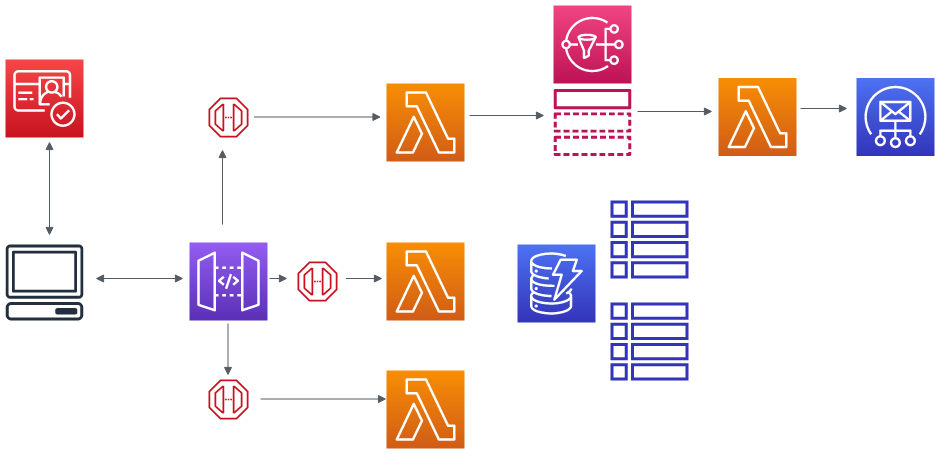

# RETO TÉCNICO BACKEND AWS + NODE JS - La Positiva

### 1. Diseño de Arquitectura

El diseño consta de Cognito como autenticador de usuarios, mediante el cual, una vez logeado, puede interactuar con el API Gateway. Este API Gateway tiene 3 endpoints que invocan a 3 Lambdas, respectivamente. Cada Lambda interactúa con la base de datos para almacenar u obtener la información solicitada. Asimismo, el Lambda que se encarga de crear la cita puede (en el caso de Perú por ejemplo) publicar un evento en un Topic de SNS, el cual invoca un Lambda que se encarga de procesar el mensaje y, finalmente, utilizar el servicio de SES para enviar un correo de confirmación al usuario. Finalmente, los datos se guardan dentro de tablas para cada país en una base de datos DynamoDB.

### 2. Manejo de Datos

Al trabajar con DynamoDB, cada país puede manejar el esquema para almacenar su información. Por ejemplo, se tienen atributos como `id`, `doctor`, `hospital`, `date` y `time`, que son atributos que ambos países comparten al momento de agendar una cita. Sin embargo, Perú añade los siguientes atributos: `dni`, `status` y `district`, que son únicos para Perú, mientras que Chile también maneja otros atributos de su país. Es por esta razón que los datos de cada país se almacenan en tablas distintas.

### 3. Procesamiento por País

- Cada país puede implementar su propia lógica dentro de las funciones, como crear cita, cancelar cita, etc. Si bien las funciones comunes son las mismas, dentro de cada una puede haber una implementación completamente diferente para cada país. Esto es posible de mantener porque para cada país se le crea un servicio, así como su DAO, para que interactúen con su respectiva base de datos.

- Para agregar un nuevo país al sistema, se debe crear un servicio nuevo que corresponda al país y un nuevo DAO que permita interactuar con su propia base de datos.

### 4. Escalabilidad y Rendimiento

Posibles cuellos de botella pueden ser la alta carga de tráfico de usuarios, la cual puede tener una posible solución, como la escalabilidad horizontal automática de las funciones Lambda, que permitiría distribuir mejor la carga. Otro cuello de botella puede ser la alta transmisión de datos entre las bases de datos y los Lambdas, la cual puede ser mitigada implementando el DAX, que permite servir como un acelerador y caché de las respuestas que brindan las bases de datos.

### 5. Seguridad y Monitoreo

Para proteger datos sensibles, como el acceso a información privada de los clientes, se puede utilizar AWS Cognito para manejar eficientemente el acceso a los recursos definidos en la infraestructura, así como el manejo de roles apropiados para cada recurso. Finalmente, se puede proteger el cuerpo de las solicitudes utilizando JWT.

### 6. Monitoreo y Manejo de Errores

Para monitorear el sistema, los Lambdas publican logs en CloudWatch, lo cual permite obtener una cantidad variada de información, así como estadísticas del rendimiento de los recursos y de los logs para ver más a detalle los problemas.

Por otro lado, algunas posibles formas de manejo de errores

- **Retries Automáticos:** Lambda tiene un proceso de reintento si es que sucede algún dentro de la función
- **Alerta y Notificación:** Se pueden configurar alertas en caso de que ocurran errores críticos que eviten el auto levantamiento de la función
- **Logging Detallado:** Asegurarse de que se loggee los errores de manera intuitiva y detallada para que se haga más accesible el proceso de debugging

### 7. Estructura del Proyecto

La definición de las funciones Lambda está dentro de la carpeta `src/handlers`. Por otro lado, los modelos, servicios, entidades y DAO se encuentran en las carpetas de `appointment` y `notification`. También se pueden ver los archivos necesarios para el linting, el formateador, el build y el deploy con SAM.

### 8. Consideraciones Adicionales

La latencia del usuario se puede manejar, como se mencionó anteriormente, con la escalabilidad automática de los Lambdas en caso de que haya mucha carga y el uso de DAX para DynamoDB.

